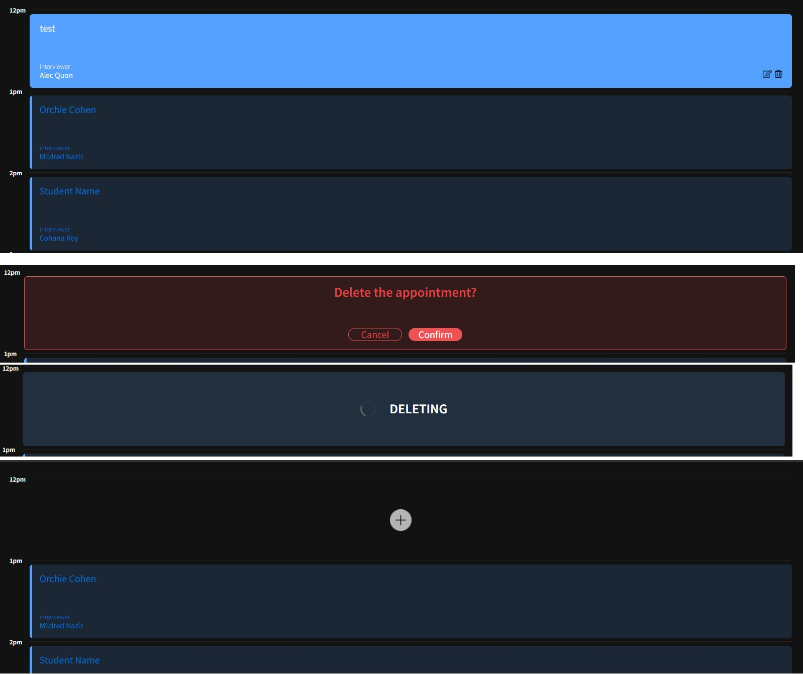

# Interview Scheduler

**Interviewer Scheduler** is a react based program for make, update, delete appointment

- can create a new appointment
- can edit appointments
- can delete appointments

## Product Screenshots

**Main Page**


**Create New Appointment**


**Edit Appointment**


**Delete Appointment**


**Spots Updated**


## Setup

Install dependencies with `npm install`.

#### Dependencies

  * axios
  * classnames
  * normalize.css
  * react
  * react-dom
  * react-scripts
  * storybook
  * testing-library/jest-dom
  * testing-library/react
  

## Running Webpack Development Server

```sh
npm start
```

## Running Jest Test Framework

```sh
npm test
```

## Running Storybook Visual Testbed

```sh
npm run storybook
```
